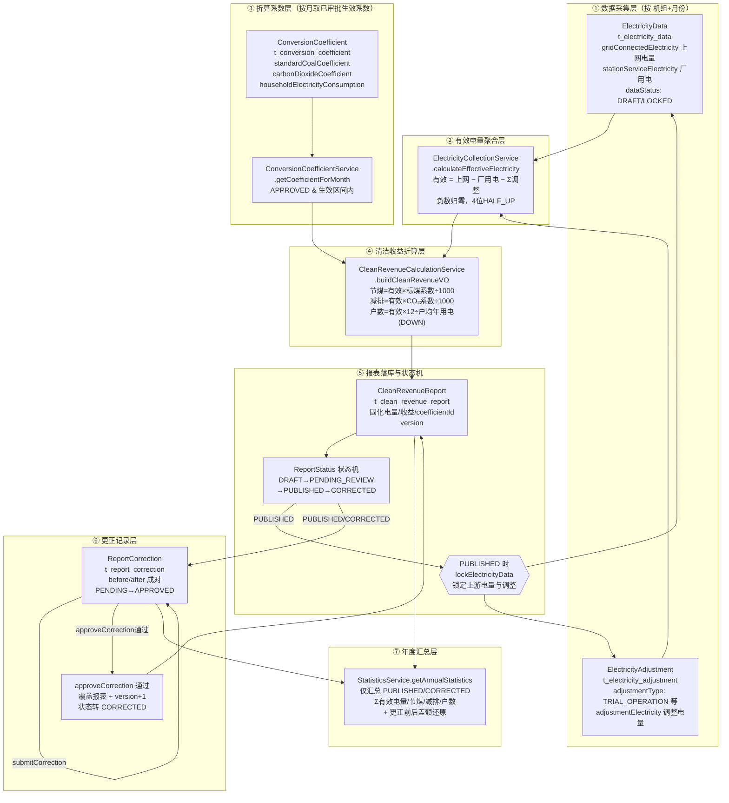

# 清洁收益核算计算口径说明

> 本文档严格依据仓库已落地的实现编写，描述"有效电量如何汇成节煤、减排与居民户数"的完整口径，以及上网电量、厂用电、试运行扣减、折算系数、报表状态、更正记录各自由哪些代码串起来。**口径以代码为准，非按需求臆测。**

---

## 一、总览：有效电量汇成清洁收益的主线

整条链路由两层服务接力完成：

1. **有效电量聚合层**：[ElectricityCollectionService.calculateEffectiveElectricity](file:///Users/ding/Documents/SOLOCODE%203/0619/macmini/zj-00407-carbonacct-5/src/main/java/com/carbonacct/service/ElectricityCollectionService.java#L133-L194) 把"上网电量 − 厂用电 − 调整电量（含试运行扣减）"汇成 `effectiveCleanElectricity`。
2. **清洁收益折算层**：[CleanRevenueCalculationService.buildCleanRevenueVO](file:///Users/ding/Documents/SOLOCODE%203/0619/macmini/zj-00407-carbonacct-5/src/main/java/com/carbonacct/service/CleanRevenueCalculationService.java#L101-L131) 取当月折算系数，把有效电量折算成节标煤、减排 CO₂、可供居民户数。

最终落库到 [CleanRevenueReport](file:///Users/ding/Documents/SOLOCODE%203/0619/macmini/zj-00407-carbonacct-5/src/main/java/com/carbonacct/domain/entity/CleanRevenueReport.java) 实体，经报表状态机流转与更正记录追溯，再由 [StatisticsService.getAnnualStatistics](file:///Users/ding/Documents/SOLOCODE%203/0619/macmini/zj-00407-carbonacct-5/src/main/java/com/carbonacct/service/StatisticsService.java#L35-L86) 做年度汇总。

### 核心算式（取自代码，非推测）

有效电量（[ElectricityCollectionService.java#L182-L188](file:///Users/ding/Documents/SOLOCODE%203/0619/macmini/zj-00407-carbonacct-5/src/main/java/com/carbonacct/service/ElectricityCollectionService.java#L182-L188)）：

```
netElectricity     = gridConnectedElectricity − stationServiceElectricity
effectiveCleanElectricity = max(netElectricity − Σ adjustmentElectricity, 0)   // 4 位小数，HALF_UP
```

清洁收益折算（[CleanRevenueCalculationService.java#L114-L128](file:///Users/ding/Documents/SOLOCODE%203/0619/macmini/zj-00407-carbonacct-5/src/main/java/com/carbonacct/service/CleanRevenueCalculationService.java#L114-L128)）：

```
standardCoalSaving       = effectiveElectricity × standardCoalCoefficient        ÷ 1000   // 4 位小数 HALF_UP
carbonDioxideReduction   = effectiveElectricity × carbonDioxideCoefficient      ÷ 1000   // 4 位小数 HALF_UP
householdCount            = effectiveElectricity × 12 ÷ householdElectricityConsumption   // 0 位小数 DOWN（截断）
```

> 说明：`standardCoalCoefficient` / `carbonDioxideCoefficient` 是"每 MWh 折算系数"，故除以 1000 还原量纲；`householdElectricityConsumption` 是"户均年用电量"，故分子乘 12（月→年）后再除，户数按 `RoundingMode.DOWN` 截断取整。

---

## 二、六类数据各自由哪些代码串起来

### 1. 上网电量（gridConnectedElectricity）

| 环节 | 代码位置 |
| --- | --- |
| 字段定义 | [ElectricityData.gridConnectedElectricity](file:///Users/ding/Documents/SOLOCODE%203/0619/macmini/zj-00407-carbonacct-5/src/main/java/com/carbonacct/domain/entity/ElectricityData.java#L23) |
| 建表约束 | [schema.sql t_electricity_data.grid_connected_electricity](file:///Users/ding/Documents/SOLOCODE%203/0619/macmini/zj-00407-carbonacct-5/src/main/resources/schema.sql#L35) `DECIMAL(18,4) NOT NULL` |
| 录入/更新 | [ElectricityCollectionService.saveElectricityData](file:///Users/ding/Documents/SOLOCODE%203/0619/macmini/zj-00407-carbonacct-5/src/main/java/com/carbonacct/service/ElectricityCollectionService.java#L42-L63) / [updateElectricityData](file:///Users/ding/Documents/SOLOCODE%203/0619/macmini/zj-00407-carbonacct-5/src/main/java/com/carbonacct/service/ElectricityCollectionService.java#L65-L77) |
| 进入计算 | [calculateEffectiveElectricity](file:///Users/ding/Documents/SOLOCODE%203/0619/macmini/zj-00407-carbonacct-5/src/main/java/com/carbonacct/service/ElectricityCollectionService.java#L172) 赋值 `totalGridElectricity`，并在 [L182](file:///Users/ding/Documents/SOLOCODE%203/0619/macmini/zj-00407-carbonacct-5/src/main/java/com/carbonacct/service/ElectricityCollectionService.java#L182) 作为被减数 |
| 落库报表 | [ReportService.generateReport](file:///Users/ding/Documents/SOLOCODE%203/0619/macmini/zj-00407-carbonacct-5/src/main/java/com/carbonacct/service/ReportService.java#L103) 写入 `report.totalGridElectricity` |
| 可追溯备注 | [buildTraceabilityRemark](file:///Users/ding/Documents/SOLOCODE%203/0619/macmini/zj-00407-carbonacct-5/src/main/java/com/carbonacct/service/ElectricityCollectionService.java#L196-L220) 拼出"上网电量: {} MWh" |

上网电量按"机组 + 月份"唯一（[schema.sql 唯一键 uk_elec_unit_month](file:///Users/ding/Documents/SOLOCODE%203/0619/macmini/zj-00407-carbonacct-5/src/main/resources/schema.sql#L44)），是有效电量公式中的**第一被加项**。

### 2. 厂用电（stationServiceElectricity）

| 环节 | 代码位置 |
| --- | --- |
| 字段定义 | [ElectricityData.stationServiceElectricity](file:///Users/ding/Documents/SOLOCODE%203/0619/macmini/zj-00407-carbonacct-5/src/main/java/com/carbonacct/domain/entity/ElectricityData.java#L24) |
| 建表约束 | [schema.sql t_electricity_data.station_service_electricity](file:///Users/ding/Documents/SOLOCODE%203/0619/macmini/zj-00407-carbonacct-5/src/main/resources/schema.sql#L36) `DECIMAL(18,4) NOT NULL` |
| 进入计算 | [calculateEffectiveElectricity](file:///Users/ding/Documents/SOLOCODE%203/0619/macmini/zj-00407-carbonacct-5/src/main/java/com/carbonacct/service/ElectricityCollectionService.java#L173) 赋值 `totalStationServiceElectricity`，并在 [L182-L183](file:///Users/ding/Documents/SOLOCODE%203/0619/macmini/zj-00407-carbonacct-5/src/main/java/com/carbonacct/service/ElectricityCollectionService.java#L182-L183) 作为第一减项 |
| 落库报表 | [ReportService.generateReport L104](file:///Users/ding/Documents/SOLOCODE%203/0619/macmini/zj-00407-carbonacct-5/src/main/java/com/carbonacct/service/ReportService.java#L104) 写入 `report.totalStationServiceElectricity` |

厂用电在公式中作为**净电量**的直接扣减项，与上网电量同表同月份录入。

### 3. 试运行扣减（ElectricityAdjustment / AdjustmentType.TRIAL_OPERATION）

调整电量并非只有试运行一种，但"试运行扣减"通过 `adjustmentType` 枚举区分。

| 环节 | 代码位置 |
| --- | --- |
| 字段定义 | [ElectricityAdjustment.adjustmentType / adjustmentElectricity](file:///Users/ding/Documents/SOLOCODE%203/0619/macmini/zj-00407-carbonacct-5/src/main/java/com/carbonacct/domain/entity/ElectricityAdjustment.java#L25-L26) |
| 试运行枚举 | [AdjustmentType.TRIAL_OPERATION](file:///Users/ding/Documents/SOLOCODE%203/0619/macmini/zj-00407-carbonacct-5/src/main/java/com/carbonacct/common/enums/AdjustmentType.java#L8)（另含限发/检修停机/设备故障/其他） |
| 录入校验 | [saveElectricityAdjustment](file:///Users/ding/Documents/SOLOCODE%203/0619/macmini/zj-00407-carbonacct-5/src/main/java/com/carbonacct/service/ElectricityCollectionService.java#L79-L91)：先 [checkDataLocked](file:///Users/ding/Documents/SOLOCODE%203/0619/macmini/zj-00407-carbonacct-5/src/main/java/com/carbonacct/service/ElectricityCollectionService.java#L108-L116) 校验当月电量未锁定 |
| 进入计算 | [calculateEffectiveElectricity L156-L180](file:///Users/ding/Documents/SOLOCODE%203/0619/macmini/zj-00407-carbonacct-5/src/main/java/com/carbonacct/service/ElectricityCollectionService.java#L156-L180)：按 `unitId + statisticsMonth` 分组后**求和所有调整类型**（试运行、限发等一并汇总为 `totalAdjustmentElectricity`），再于 [L184](file:///Users/ding/Documents/SOLOCODE%203/0619/macmini/zj-00407-carbonacct-5/src/main/java/com/carbonacct/service/ElectricityCollectionService.java#L184) 作为净电量的第二减项 |
| 落库报表 | [ReportService.generateReport L105](file:///Users/ding/Documents/SOLOCODE%203/0619/macmini/zj-00407-carbonacct-5/src/main/java/com/carbonacct/service/ReportService.java#L105) 写入 `report.totalAdjustmentElectricity` |
| 按类型可追溯 | [buildTraceabilityRemark L201-L214](file:///Users/ding/Documents/SOLOCODE%203/0619/macmini/zj-00407-carbonacct-5/src/main/java/com/carbonacct/service/ElectricityCollectionService.java#L201-L214) 按 `AdjustmentType` 分组后拼出"试运行: {} MWh"等明细 |

> 关键口径：代码在汇总阶段**不区分调整类型**，所有 `adjustmentElectricity` 一并相加作为扣减；"试运行"仅在追溯备注里按类型展示明细。负数保护在 [L185-L187](file:///Users/ding/Documents/SOLOCODE%203/0619/macmini/zj-00407-carbonacct-5/src/main/java/com/carbonacct/service/ElectricityCollectionService.java#L185-L187)：若扣减后 < 0 则归零。

### 4. 折算系数（ConversionCoefficient）

| 环节 | 代码位置 |
| --- | --- |
| 字段定义 | [ConversionCoefficient](file:///Users/ding/Documents/SOLOCODE%203/0619/macmini/zj-00407-carbonacct-5/src/main/java/com/carbonacct/domain/entity/ConversionCoefficient.java)：`standardCoalCoefficient` / `carbonDioxideCoefficient` / `householdElectricityConsumption` |
| 建表约束 | [schema.sql t_conversion_coefficient](file:///Users/ding/Documents/SOLOCODE%203/0619/macmini/zj-00407-carbonacct-5/src/main/resources/schema.sql#L66-L84) |
| 创建 | [ConversionCoefficientService.createCoefficient](file:///Users/ding/Documents/SOLOCODE%203/0619/macmini/zj-00407-carbonacct-5/src/main/java/com/carbonacct/service/ConversionCoefficientService.java#L32-L51)：默认 `PENDING`、`isCurrent=false`，版本号唯一 |
| 审批生效 | [approveCoefficient](file:///Users/ding/Documents/SOLOCODE%203/0619/macmini/zj-00407-carbonacct-5/src/main/java/com/carbonacct/service/ConversionCoefficientService.java#L53-L77)：通过后调用 [setAsCurrent](file:///Users/ding/Documents/SOLOCODE%203/0619/macmini/zj-00407-carbonacct-5/src/main/java/com/carbonacct/service/ConversionCoefficientService.java#L79-L116)，自动算出 `expiryDate`（取下一个已通过且生效日晚于本条的系数的前一天） |
| 按月取系数 | [getCoefficientForMonth](file:///Users/ding/Documents/SOLOCODE%203/0619/macmini/zj-00407-carbonacct-5/src/main/java/com/carbonacct/service/ConversionCoefficientService.java#L118-L134)：取 `APPROVED` 且 `effectiveDate ≤ 月首 ≤ expiryDate(或空)`，按 `effectiveDate DESC` 取首条 |
| 进入折算 | [CleanRevenueCalculationService.calculateCleanRevenue L42-L43](file:///Users/ding/Documents/SOLOCODE%203/0619/macmini/zj-00407-carbonacct-5/src/main/java/com/carbonacct/service/CleanRevenueCalculationService.java#L42-L43) 取月系数，传入 [buildCleanRevenueVO L114-L128](file:///Users/ding/Documents/SOLOCODE%203/0619/macmini/zj-00407-carbonacct-5/src/main/java/com/carbonacct/service/CleanRevenueCalculationService.java#L114-L128) 完成三个折算 |
| 落库报表 | [ReportService.generateReport L102](file:///Users/ding/Documents/SOLOCODE%203/0619/macmini/zj-00407-carbonacct-5/src/main/java/com/carbonacct/service/ReportService.java#L102) 把 `coefficient.id` 固化到 `report.coefficientId`，保证历史报表可按当时系数复算 |

> 口径要点：系数按"生效区间 + 审批通过"取值，未审批或不在区间的系数不参与计算（取不到直接抛 [BusinessException](file:///Users/ding/Documents/SOLOCODE%203/0619/macmini/zj-00407-carbonacct-5/src/main/java/com/carbonacct/service/ConversionCoefficientService.java#L130-L131)）。报表生成时把系数 ID 冻结进报表，使历史结果可追溯复现。

### 5. 报表状态（ReportStatus）

| 环节 | 代码位置 |
| --- | --- |
| 枚举定义 | [ReportStatus](file:///Users/ding/Documents/SOLOCODE%203/0619/macmini/zj-00407-carbonacct-5/src/main/java/com/carbonacct/common/enums/ReportStatus.java)：`DRAFT / PENDING_REVIEW / PUBLISHED / CORRECTED` |
| 状态机 | [canTransitionTo](file:///Users/ding/Documents/SOLOCODE%203/0619/macmini/zj-00407-carbonacct-5/src/main/java/com/carbonacct/common/enums/ReportStatus.java#L25-L32)：`DRAFT→PENDING_REVIEW`、`PENDING_REVIEW→PUBLISHED\|DRAFT`、`PUBLISHED→CORRECTED`、`CORRECTED` 终态 |
| 流转入口 | [ReportService.transitionStatus](file:///Users/ding/Documents/SOLOCODE%203/0619/macmini/zj-00407-carbonacct-5/src/main/java/com/carbonacct/service/ReportService.java#L131-L160)：非法流转抛异常；流转到 `PUBLISHED` 时记录 `reviewedBy/publishedBy` 并 [lockElectricityData](file:///Users/ding/Documents/SOLOCODE%203/0619/macmini/zj-00407-carbonacct-5/src/main/java/com/carbonacct/service/ElectricityCollectionService.java#L118-L131) 锁定该机组当月电量与调整记录 |
| 生成即草稿 | [generateReport L110](file:///Users/ding/Documents/SOLOCODE%203/0619/macmini/zj-00407-carbonacct-5/src/main/java/com/carbonacct/service/ReportService.java#L110) 新生报表置 `DRAFT`；[L75-L78](file:///Users/ding/Documents/SOLOCODE%203/0619/macmini/zj-00407-carbonacct-5/src/main/java/com/carbonacct/service/ReportService.java#L75-L78) 仅 `DRAFT` 状态才允许重新生成 |
| 年度统计筛选 | [listPublishedReportsForYear](file:///Users/ding/Documents/SOLOCODE%203/0619/macmini/zj-00407-carbonacct-5/src/main/java/com/carbonacct/service/ReportService.java#L398-L411) 仅汇总 `PUBLISHED` 或 `CORRECTED` |

> 口径要点：发布即"冻结上游"——一旦 `PUBLISHED`，对应机组当月电量/调整数据被锁定（`DataStatus.LOCKED`），[saveElectricityData](file:///Users/ding/Documents/SOLOCODE%203/0619/macmini/zj-00407-carbonacct-5/src/main/java/com/carbonacct/service/ElectricityCollectionService.java#L52-L53) 与 [saveElectricityAdjustment](file:///Users/ding/Documents/SOLOCODE%203/0619/macmini/zj-00407-carbonacct-5/src/main/java/com/carbonacct/service/ElectricityCollectionService.java#L108-L116) 均拒绝修改，保证已发布口径不被悄悄改动；如需变更必须走更正。

### 6. 更正记录（ReportCorrection）

| 环节 | 代码位置 |
| --- | --- |
| 实体 | [ReportCorrection](file:///Users/ding/Documents/SOLOCODE%203/0619/macmini/zj-00407-carbonacct-5/src/main/java/com/carbonacct/domain/entity/ReportCorrection.java)：成对保存 before/after 的电量、节煤、减排、户数与系数版本，`correctedVersion = originalVersion + 1` |
| 建表约束 | [schema.sql t_report_correction](file:///Users/ding/Documents/SOLOCODE%203/0619/macmini/zj-00407-carbonacct-5/src/main/resources/schema.sql#L128-L157) |
| 提交更正 | [ReportService.submitCorrection](file:///Users/ding/Documents/SOLOCODE%203/0619/macmini/zj-00407-carbonacct-5/src/main/java/com/carbonacct/service/ReportService.java#L162-L228)：仅 `PUBLISHED/CORRECTED` 可更正；同一报表存在 `PENDING` 更正时禁止再提；若换了系数则用 [calculateByEffectiveAndCoefficient](file:///Users/ding/Documents/SOLOCODE%203/0619/macmini/zj-00407-carbonacct-5/src/main/java/com/carbonacct/service/ReportService.java#L192-L202) 复算节煤/减排/户数并回填 DTO；更正记录置 `PENDING` |
| 审批生效 | [ReportService.approveCorrection](file:///Users/ding/Documents/SOLOCODE%203/0619/macmini/zj-00407-carbonacct-5/src/main/java/com/carbonacct/service/ReportService.java#L230-L265)：通过时用 after 值覆盖报表、状态置 `CORRECTED`、`version+1`；驳回则仅记录不动报表 |
| 更正前后对比 | [StatisticsService.fillCorrectionDiff](file:///Users/ding/Documents/SOLOCODE%203/0619/macmini/zj-00407-carbonacct-5/src/main/java/com/carbonacct/service/StatisticsService.java#L88-L140)：用每报表**第一条**已通过更正的 before 值还原"原始年度总额"，与当前总额做差 |
| 旧接口（已废弃） | [correctReport](file:///Users/ding/Documents/SOLOCODE%203/0619/macmini/zj-00407-carbonacct-5/src/main/java/com/carbonacct/service/ReportService.java#L267-L330) `@Deprecated`，直接改报表不经审批，仅保留兼容 |

> 口径要点：更正走"提交→审批"两段式。审批通过前不动主报表；通过后主报表被覆盖并升版本号、状态转 `CORRECTED`。`ReportCorrection` 成对保存前后值，使任何一次更正都可审计回放。

---

## 三、现有计算链路图



---

## 四、口径速查表（实现依据）

| 输出指标 | 计算来源 | 关键代码 |
| --- | --- | --- |
| 有效清洁电量 | 上网电量 − 厂用电 − Σ调整电量（≥0） | [ElectricityCollectionService#L182-L188](file:///Users/ding/Documents/SOLOCODE%203/0619/macmini/zj-00407-carbonacct-5/src/main/java/com/carbonacct/service/ElectricityCollectionService.java#L182-L188) |
| 节约标准煤 | 有效电量 × 标煤系数 ÷ 1000（4位 HALF_UP） | [CleanRevenueCalculationService#L114-L117](file:///Users/ding/Documents/SOLOCODE%203/0619/macmini/zj-00407-carbonacct-5/src/main/java/com/carbonacct/service/CleanRevenueCalculationService.java#L114-L117) |
| 减排 CO₂ | 有效电量 × CO₂系数 ÷ 1000（4位 HALF_UP） | [CleanRevenueCalculationService#L119-L122](file:///Users/ding/Documents/SOLOCODE%203/0619/macmini/zj-00407-carbonacct-5/src/main/java/com/carbonacct/service/CleanRevenueCalculationService.java#L119-L122) |
| 可供居民户数 | 有效电量 × 12 ÷ 户均年用电（0位 DOWN） | [CleanRevenueCalculationService#L124-L128](file:///Users/ding/Documents/SOLOCODE%203/0619/macmini/zj-00407-carbonacct-5/src/main/java/com/carbonacct/service/CleanRevenueCalculationService.java#L124-L128) |
| 系数选取 | 已审批 + 生效区间覆盖该月，取 effectiveDate 最新 | [ConversionCoefficientService#L118-L134](file:///Users/ding/Documents/SOLOCODE%203/0619/macmini/zj-00407-carbonacct-5/src/main/java/com/carbonacct/service/ConversionCoefficientService.java#L118-L134) |
| 报表生成 | 取有效电量 + 当月系数折算，固化 coefficientId | [ReportService#L61-L118](file:///Users/ding/Documents/SOLOCODE%203/0619/macmini/zj-00407-carbonacct-5/src/main/java/com/carbonacct/service/ReportService.java#L61-L118) |
| 数据冻结 | 报表 PUBLISHED 即锁定对应机组当月电量/调整 | [ReportService#L149-L154](file:///Users/ding/Documents/SOLOCODE%203/0619/macmini/zj-00407-carbonacct-5/src/main/java/com/carbonacct/service/ReportService.java#L149-L154) |
| 更正生效 | 审批通过覆盖报表并 version+1、转 CORRECTED | [ReportService#L252-L262](file:///Users/ding/Documents/SOLOCODE%203/0619/macmini/zj-00407-carbonacct-5/src/main/java/com/carbonacct/service/ReportService.java#L252-L262) |
| 年度汇总 | Σ 已发布/已更正报表的四项指标 | [StatisticsService#L59-L70](file:///Users/ding/Documents/SOLOCODE%203/0619/macmini/zj-00407-carbonacct-5/src/main/java/com/carbonacct/service/StatisticsService.java#L59-L70) |

---

## 五、口径边界与实现约定

1. **唯一性**：电量按 `unit_id + statistics_month` 唯一（[uk_elec_unit_month](file:///Users/ding/Documents/SOLOCODE%203/0619/macmini/zj-00407-carbonacct-5/src/main/resources/schema.sql#L44)）；报表按 `unit_id + statistics_month` 唯一（[uk_report_unit_month](file:///Users/ding/Documents/SOLOCODE%203/0619/macmini/zj-00407-carbonacct-5/src/main/resources/schema.sql#L125)）。
2. **可修改性**：电量/调整为 `DRAFT` 时可改，`LOCKED` 后拒绝（[saveElectricityData#L52-L53](file:///Users/ding/Documents/SOLOCODE%203/0619/macmini/zj-00407-carbonacct-5/src/main/java/com/carbonacct/service/ElectricityCollectionService.java#L52-L53)）。
3. **试运行等调整不分类汇总**：所有 `AdjustmentType` 的电量在 [L177-L180](file:///Users/ding/Documents/SOLOCODE%203/0619/macmini/zj-00407-carbonacct-5/src/main/java/com/carbonacct/service/ElectricityCollectionService.java#L177-L180) 一并相加扣减，类型仅用于追溯备注。
4. **系数不可回溯改历史**：报表生成时固化 `coefficientId`，后续系数版本变更不影响已生成报表，除非走更正（[submitCorrection#L184-L202](file:///Users/ding/Documents/SOLOCODE%203/0619/macmini/zj-00407-carbonacct-5/src/main/java/com/carbonacct/service/ReportService.java#L184-L202)）。
5. **年度统计排除草稿/待复核**：仅 `PUBLISHED` 与 `CORRECTED` 计入年度总额（[listPublishedReportsForYear#L405-L407](file:///Users/ding/Documents/SOLOCODE%203/0619/macmini/zj-00407-carbonacct-5/src/main/java/com/carbonacct/service/ReportService.java#L405-L407)）。
6. **更正前后差额还原**：以每报表**首条**已通过更正的 before 值还原原始总额（[StatisticsService#L179-L184](file:///Users/ding/Documents/SOLOCODE%203/0619/macmini/zj-00407-carbonacct-5/src/main/java/com/carbonacct/service/StatisticsService.java#L179-L184)），多轮更正的中间态不参与差额计算。
